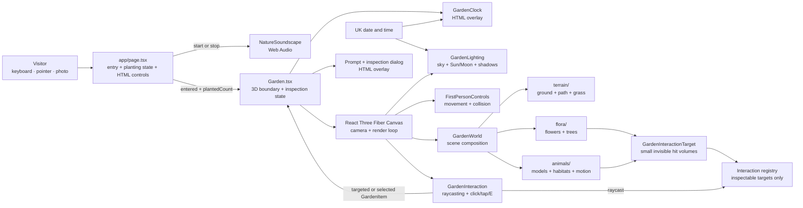

# Garden modules

The garden is organised by responsibility so related rendering, data, and tests stay together.

## Runtime architecture

Read this diagram from left to right. It shows how browser input becomes page state, how that state enters the Three.js world, and how a 3D target returns to the HTML interface.

The most important boundaries are:

1. `app/page.tsx` owns the visit-level interface state: entering, sound activation, photo selection, and the number of planted flowers.
2. `Garden.tsx` translates that state into a WebGL scene and translates 3D inspection results back into accessible HTML overlays.
3. `GardenWorld.tsx` only composes physical scene modules; each responsibility folder owns its own implementation.
4. Flora and animals register small interaction targets, so raycasting never searches the entire scene.
5. UK time is one shared input for both the visible clock and the garden's celestial lighting.

## Module map

| Module | Owns |
| --- | --- |
| `Garden.tsx` | The public 3D garden interface used by the page |
| `GardenWorld.tsx` | Composition of terrain, flora, and animals |
| `garden-layout.ts` | Dimensions shared by rendering and movement |
| `animals/` | Animal models, animation, identities, and habitats |
| `audio/` | The browser Web Audio soundscape |
| `flora/` | Flowers, trees, placement data, and flora composition |
| `interaction/` | Target registration, raycasting, and inspection UI |
| `lighting/` | UK time, Sun, Moon, drifting clouds, and world shadow policy |
| `navigation/` | First-person input, boundaries, and collision |
| `terrain/` | Ground, path, grass rendering, and grass geometry |

`Garden.tsx` and `GardenWorld.tsx` are composition modules. Feature implementation should remain in the responsibility folder that owns it.

The page mounts `audio/NatureSoundscape.tsx` directly because browser autoplay rules require its `start()` interface to run inside the threshold click gesture. It remains part of the garden module even though it sits beside, rather than inside, the WebGL canvas.
